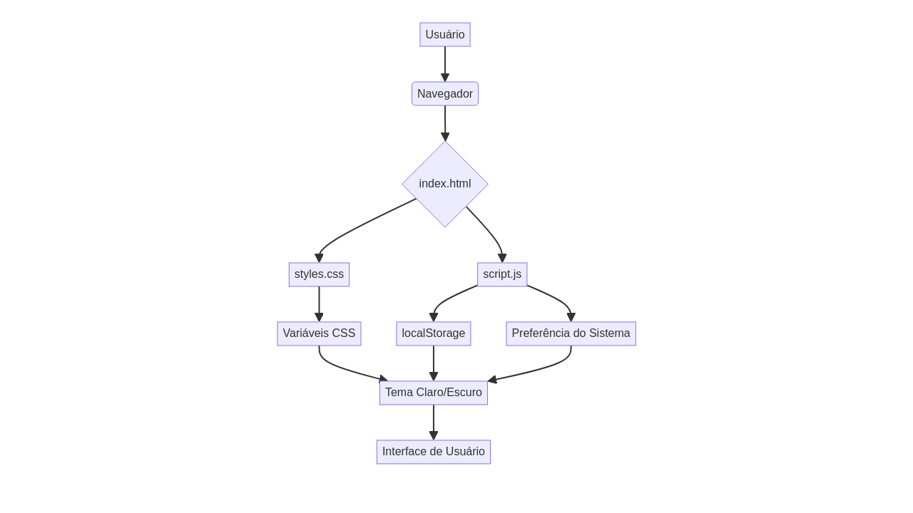
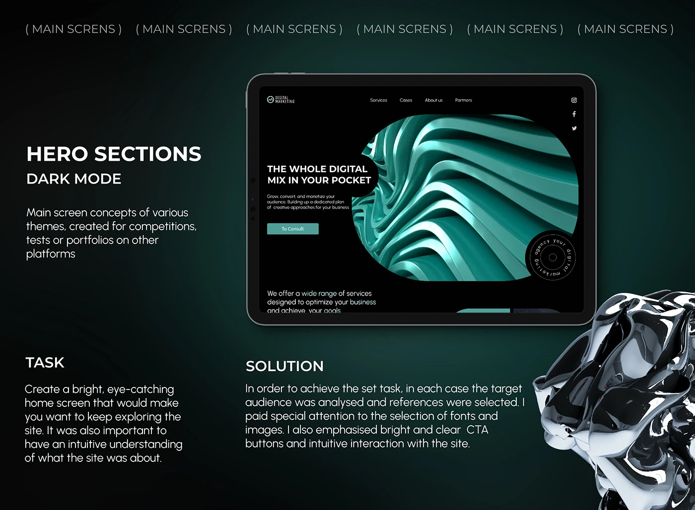

# Dark Mode Design System


Um sistema de design completo e profissional com suporte a modo escuro, alternância de temas e conformidade com diretrizes de acessibilidade. Este projeto implementa as melhores práticas para interfaces modernas, garantindo uma experiência de usuário otimizada e responsiva, com foco em performance e manutenibilidade. A autoria de todo o trabalho é de Gabriel Demetrios Lafis.

---

A complete and professional design system with dark mode support, theme switching, and accessibility compliance. This project implements best practices for modern interfaces, ensuring an optimized and responsive user experience, with a focus on performance and maintainability. All work is authored by Gabriel Demetrios Lafis.

## 🚀 Demonstração / Demo

Este projeto oferece um sistema de design robusto que suporta automaticamente modo claro e escuro, respeitando as preferências do sistema operacional do usuário. Além disso, permite a alternância manual de temas e persiste a escolha do usuário.

---

This project offers a robust design system that automatically supports light and dark modes, respecting the user's operating system preferences. Additionally, it allows manual theme switching and persists the user's choice.

## ✨ Características / Features

- **Modo Escuro Automático / Automatic Dark Mode**: Detecção automática da preferência do sistema operacional para aplicar o tema adequado.
- **Alternância Manual / Manual Toggle**: Botão intuitivo para alternar entre os temas claro e escuro a qualquer momento.
- **Persistência / Persistence**: A preferência de tema do usuário é salva localmente para uma experiência consistente entre sessões.
- **Acessibilidade / Accessibility**: Desenvolvido com foco em conformidade com as diretrizes WCAG 2.1, garantindo inclusão.
- **Performance / Performance**: Transições de tema suaves e otimizadas para não impactar o desempenho da aplicação.
- **Estrutura Profissional / Professional Structure**: Organização de arquivos e pastas seguindo padrões de projetos modernos.

## 🛠️ Tecnologias Utilizadas / Technologies Used

- **HTML5**: Estrutura semântica e acessível para o conteúdo web.
- **CSS3**: Utilização de Custom Properties (Variáveis CSS), Media Queries para responsividade e transições suaves.
- **JavaScript**: Lógica para controle de temas, persistência e interatividade.
- **Google Fonts (Inter)**: Tipografia moderna e legível para uma melhor experiência visual.

## 📁 Estrutura do Projeto / Project Structure

```
Dark-Mode-Design-System/
├── src/                # Código fonte da aplicação (HTML, CSS, JS)
│   ├── index.html      # Demonstração do sistema
│   ├── styles.css      # Sistema de temas e componentes
│   └── script.js       # Lógica de alternância de temas
├── tests/              # Testes unitários e de integração
├── docs/               # Documentação adicional e diagramas
├── config/             # Arquivos de configuração (LICENSE, CONTRIBUTING.md)
│   ├── LICENSE         # Licença MIT
│   └── CONTRIBUTING.md # Diretrizes para contribuição
├── .gitignore          # Arquivos ignorados pelo Git
└── README.md           # Documentação principal do projeto
```

## 🚀 Como Usar / How to Use

### Instalação / Installation

1.  **Clone o repositório / Clone the repository**:
    ```bash
    git clone https://github.com/galafis/Dark-Mode-Design-System.git
    cd Dark-Mode-Design-System
    ```

2.  **Abra o arquivo `index.html` no navegador / Open `index.html` in your browser**:
    Você pode simplesmente abrir o arquivo `src/index.html` diretamente no seu navegador ou usar um servidor local para melhor experiência:
    
    ---
    
You can simply open the `src/index.html` file directly in your browser or use a local server for a better experience:

    ```bash
    # Usando Python / Using Python
    python -m http.server 8000

    # Usando Node.js / Using Node.js
    npx serve .
    ```

### Implementação do Sistema / System Implementation

#### 1. Variáveis CSS para Temas / CSS Variables for Themes

O sistema utiliza variáveis CSS para gerenciar cores e outros tokens de design, facilitando a personalização e a alternância de temas.

---

The system uses CSS variables to manage colors and other design tokens, making customization and theme switching easy.

```css
:root {
    /* Tema Claro Padrão / Default Light Theme */
    --bg-primary: #ffffff;
    --bg-secondary: #f8f9fa;
    --text-primary: #212529;
    --text-secondary: #6c757d;
    --border-color: #dee2e6;
}

[data-theme="dark"] {
    /* Tema Escuro / Dark Theme */
    --bg-primary: #1a1a1a;
    --bg-secondary: #2d2d2d;
    --text-primary: #ffffff;
    --text-secondary: #b0b0b0;
    --border-color: #404040;
}
```

#### 2. Detecção Automática de Preferência / Automatic Preference Detection

O CSS detecta automaticamente a preferência de tema do sistema operacional do usuário através de media queries.

---

CSS automatically detects the user's operating system theme preference via media queries.

```css
@media (prefers-color-scheme: dark) {
    :root {
        --bg-primary: #1a1a1a;
        --bg-secondary: #2d2d2d;
        --text-primary: #ffffff;
        --text-secondary: #b0b0b0;
    }
}
```

#### 3. Controle JavaScript / JavaScript Control

O `script.js` gerencia a alternância manual de temas e a persistência da escolha do usuário no `localStorage`.

---

The `script.js` manages manual theme switching and persistence of the user's choice in `localStorage`.

```javascript
// Detectar preferência do sistema / Detect system preference
const prefersDark = window.matchMedia("(prefers-color-scheme: dark)");

// Alternar tema / Toggle theme
function toggleTheme() {
    const currentTheme = document.documentElement.getAttribute("data-theme");
    const newTheme = currentTheme === "dark" ? "light" : "dark";
    
    document.documentElement.setAttribute("data-theme", newTheme);
    localStorage.setItem("theme", newTheme);
}
```

## 🎨 Sistema de Cores / Color System

### Tema Claro / Light Theme
- **Background Primary**: `#ffffff`
- **Background Secondary**: `#f8f9fa`
- **Text Primary**: `#212529`
- **Text Secondary**: `#6c757d`
- **Accent**: `#667eea`

### Tema Escuro / Dark Theme
- **Background Primary**: `#1a1a1a`
- **Background Secondary**: `#2d2d2d`
- **Text Primary**: `#ffffff`
- **Text Secondary**: `#b0b0b0`
- **Accent**: `#8b9aff`

## ♿ Acessibilidade / Accessibility

Este sistema de design foi construído com princípios de acessibilidade em mente:

---

This design system was built with accessibility principles in mind:

- **Contraste / Contrast**: Todas as combinações de cores atendem ou excedem os requisitos de contraste WCAG AA (4.5:1).
- **Foco / Focus**: Indicadores visuais claros são fornecidos para elementos interativos, facilitando a navegação por teclado.
- **Leitores de Tela / Screen Readers**: Suporte completo com atributos ARIA labels e semântica HTML adequada.
- **Redução de Movimento / Reduced Motion**: Respeita a preferência do usuário por `prefers-reduced-motion`, desativando animações desnecessárias.

## 📱 Responsividade / Responsiveness

O sistema é totalmente responsivo, adaptando-se a diferentes tamanhos de tela e dispositivos com breakpoints otimizados para uma experiência consistente.

---

The system is fully responsive, adapting to different screen sizes and devices with optimized breakpoints for a consistent experience.

```css
/* Mobile: 320px - 767px */
/* Tablet: 768px - 1023px */
/* Desktop: 1024px+ */
```

## 🔧 Personalização / Customization

### Adicionando Novos Componentes / Adding New Components

É fácil estender o sistema adicionando novos componentes que herdam as variáveis de tema.

---

It's easy to extend the system by adding new components that inherit theme variables.

```css
.new-component {
    background-color: var(--bg-secondary);
    color: var(--text-primary);
    border: 1px solid var(--border-color);
    transition: all 0.3s ease;
}
```

### Customizando Cores / Customizing Colors

As cores podem ser facilmente ajustadas modificando as variáveis CSS no bloco `:root`.

---

Colors can be easily adjusted by modifying the CSS variables in the `:root` block.

```css
:root {
    --primary-hue: 230;
    --primary-saturation: 70%;
    --primary-lightness: 60%;
}
```

## 🤝 Contribuindo / Contributing

Contribuições são muito bem-vindas! Para contribuir com o projeto, por favor, siga as diretrizes detalhadas em [CONTRIBUTING.md](config/CONTRIBUTING.md).

---

Contributions are very welcome! To contribute to the project, please follow the detailed guidelines in [CONTRIBUTING.md](config/CONTRIBUTING.md).

## 📄 Licença / License

Este projeto está licenciado sob a Licença MIT - veja o arquivo [LICENSE](config/LICENSE) para detalhes.

---

This project is licensed under the MIT License - see the [LICENSE](config/LICENSE) file for details.

## 👨‍💻 Autor / Author

**Gabriel Demetrios Lafis**

- GitHub: [@galafis](https://github.com/galafis)
- Email: gabrieldemetrios@gmail.com

---

⭐ Se este projeto foi útil, considere deixar uma estrela! / If this project was helpful, please consider leaving a star! ⭐


## 📊 Diagrama de Arquitetura / Architecture Diagram

Este diagrama ilustra a arquitetura do sistema de design, mostrando como os componentes interagem para fornecer a funcionalidade de modo claro/escuro.

---

This diagram illustrates the design system's architecture, showing how components interact to provide light/dark mode functionality.




## 🖼️ Imagem Hero / Hero Image

Uma representação visual do sistema de design em ação, destacando a estética e funcionalidade do modo escuro.

---

A visual representation of the design system in action, highlighting the aesthetics and functionality of dark mode.



