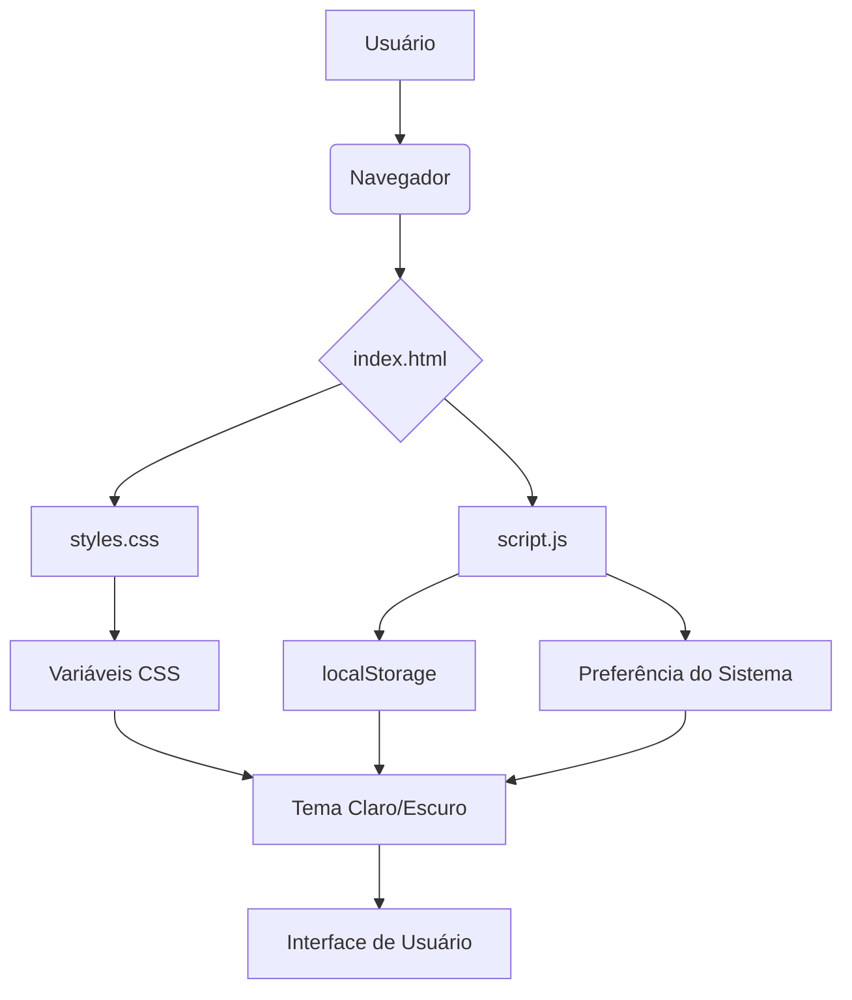

```mermaid
graph TD
    A[Usuário] --> B(Navegador)
    B --> C{index.html}
    C --> D[styles.css]
    C --> E[script.js]
    D --> F[Variáveis CSS]
    E --> G[localStorage]
    E --> H[Preferência do Sistema]
    F --> I[Tema Claro/Escuro]
    G --> I
    H --> I
    I --> J[Interface de Usuário]
```
